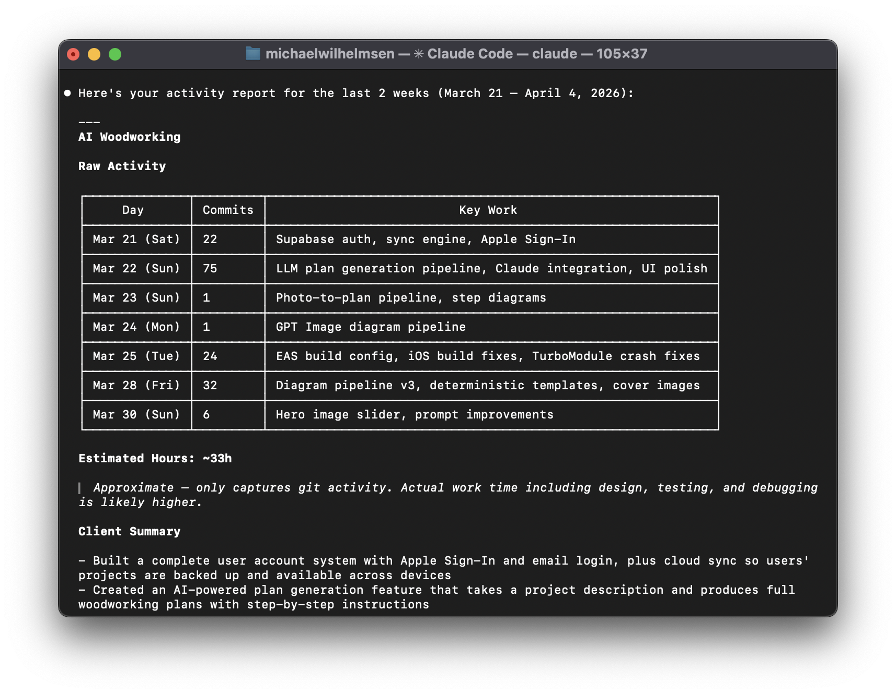
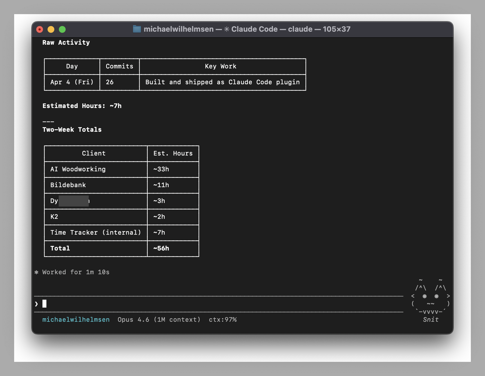

# Git Timetrack

It's Friday. You have no idea what you did this week.

You know you _worked_ — you were in the zone, fixing things, shipping things. But now your PM wants a status update, your client needs a time report, and you're staring at a blank email trying to reconstruct five days from memory. So you skim through git logs, guess at hours, and write something that feels vaguely dishonest.

**Git Timetrack** fixes this. It silently watches your git activity — commits, branch switches, merges — and logs everything to a local file. No timers to start. No buttons to press. You just code.

Then you ask Claude, and get:

- Per-project activity grouped into work sessions
- Time measured from your Claude Code sessions, not guessed from commits
- Client-ready summaries in any language





## Requirements

- [Claude Code](https://claude.ai/code)
- Python 3.6+

## Install

```
/plugin marketplace add michaelwilhelmsen/git-timetrack
/plugin install git-timetrack@git-timetrack
```

That's it. The plugin hooks into your git commands automatically — no configuration needed.

## Usage

### Time reports

Use `/timelog` to summarize your activity. Claude reads your git history and writes human-friendly reports.

```
/timelog
/timelog today
/timelog this week for acme
/timelog last month, invoice format
/timelog in german, professional tone
```

> You can also use the full name `/git-timetrack:timelog`.

Claude translates `fix: MutationObserver feedback loop in cart widget` into `Fixed an issue where the shopping cart wasn't updating correctly` — a client-ready summary you can use however you like.

You can have a conversation about it: _"Combine those first two bullets."_ _"Make it more formal."_ _"Skip the infrastructure stuff, the client doesn't care."_

### Import past activity

Just installed? Use `/import` to backfill your git history into the tracking log.

```
/import
/import last 2 weeks
/import /path/to/repo last month
```

Claude finds your repos, filters to your commits, and imports them — so `/timelog` can report on work done before the plugin was installed.

> You can also use the full name `/git-timetrack:import`.

### Map projects to clients

Use `/map-client` to associate repos with client names. Claude walks through your unmapped repos and suggests mappings.

```
/map-client
/map-client my-repo "Acme Corp"
```

> You can also use the full name `/git-timetrack:map-client`.

## How time is worked out

Two sources, and the first one is measured rather than guessed.

**Claude Code sessions (measured).** Every session writes a transcript to `~/.claude/projects/`, with a timestamp on each message plus the working directory, branch and session title. The reader turns those into real spans — when the work started, when it stopped. Run it any time:

```bash
python3 ~/.claude/plugins/git-timetrack/bin/session-reader.py
```

It rebuilds `~/.git-timetrack/sessions.jsonl` from all history in a few seconds. `--report --days 7` rebuilds and prints a compact digest for the range, which is what the timelog skill runs. `--dry-run --days 30` compares measured time against the git estimate without writing anything.

Three knobs, all guesses — the dry run shows what each contributes so you can calibrate:

| Flag | Default | What it does |
| ---- | ------- | ------------ |
| `--gap` | 30 min | The pause that ends a stretch of work — and therefore what counts as one billable task. Restarting a session to manage context does not start a new one |
| `--tail` | 5 min | Padding after a session's last message |
| `--bridge` | 120 min | Keeps a session whole across a wait while a subagent worked. Capped, because an unattended overnight agent run is machine time, not yours. `0` disables it |

Subagent transcripts are never counted as time of their own — the main session records activity again the moment a subagent reports back, so their work is already inside the session's span.

**Git commits (estimated).** For work done outside Claude Code, the old heuristics still apply:

- Commits within **1.5 hours** of each other → the gap counts as work time
- **Isolated commits** → estimated at 30min–2hr based on diff size

**Billing policy.** The digest bills each session at a minimum of 30 minutes and rounds part-hours up to the next 30-minute step (1h05 bills 1h30). Parallel sessions bill to every client in full — two clients worked at once are both charged, not split. `TOTAL` is therefore above `MEASURED` by design, and the digest prints both so you can see the spread.

Measured spans are used where they exist, with commit estimates elsewhere. Still **read it before sending** — time away from the keyboard mid-session counts as work, and a session left open all evening looks like billable time.

## What gets tracked

| Event                                   | Captured data                                              |
| --------------------------------------- | ---------------------------------------------------------- |
| `git commit`                            | Message, hash, branch, files changed, insertions/deletions |
| `git checkout` / `git switch`           | New branch                                                 |
| `git merge`                             | Branch                                                     |
| `git push` / `git pull` / `git rebase`  | Branch                                                     |

Everything is stored locally in `~/.git-timetrack/activity.jsonl`. Nothing is sent anywhere. The file is plain JSON Lines — one object per event — so you can grep it, pipe it, or build your own tools on top.

## Data format

```json
{
  "timestamp": "2025-03-28T14:23:01Z",
  "event": "commit",
  "repo": "acme-website",
  "branch": "main",
  "client": "Acme Corp",
  "commit_hash": "a1b2c3d",
  "commit_message": "fix: resolve checkout page crash on mobile",
  "files_changed": 3,
  "insertions": 42,
  "deletions": 7,
  "new_branch": "",
  "command": "git commit -m '...'",
  "cwd": "/Users/you/projects/acme-website"
}
```

## Data storage

| File         | Location                          | Purpose                                              |
| ------------ | --------------------------------- | ---------------------------------------------------- |
| Activity log | `~/.git-timetrack/activity.jsonl` | Append-only git event log (created on first git event) |
| Session log  | `~/.git-timetrack/sessions.jsonl` | Measured Claude Code sessions (rebuilt by the reader) |
| Client map   | `~/.git-timetrack/clients.json`   | Repo → client name mapping                           |
| Ignore list  | `~/.git-timetrack/ignore`         | Repos to exclude (one name per line)                 |

## FAQ

**Does this track my time outside of git?**
Partly. Claude Code sessions are measured whether or not you commit, so research, debugging and reviews are counted. Work with no Claude Code session and no commit — meetings, editing straight in your IDE — stays invisible, so your real hours are still likely higher than reported.

**Do my prompts leave my machine?**
No. The reader stores session titles and a few prompts locally in `sessions.jsonl` so reports can be described accurately, and the timelog skill is instructed never to paste prompt text into output. Everything stays in `~/.git-timetrack/`.

**Why do the hours sometimes exceed the day?**
By policy. Parallel sessions bill to every client, so an hour on two projects is two billed hours, and every session rounds up to a 30-minute step. The digest prints measured activity alongside the billable total, plus how much came from each rule.

**Does this send my data anywhere?**
No. Everything stays in `~/.git-timetrack/` on your machine.

**What about repos I don't want tracked?**
Add the repo name to `~/.git-timetrack/ignore` (one per line). The handler checks this file before logging.

**How do I uninstall?**
```
/plugin uninstall git-timetrack@git-timetrack
```
Your activity data in `~/.git-timetrack/` is preserved. Delete it manually if you want.

## Contributing

Issues and PRs welcome at [github.com/michaelwilhelmsen/git-timetrack](https://github.com/michaelwilhelmsen/git-timetrack).

## License

MIT
